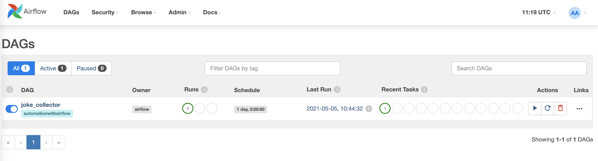

# 🧑‍🏭 🖥️ Full Stack Data Scientist Part 6: Automation with Airflow

A simple example of using Airflow to create a worflow for calling APIs.

# 🌊 Quick start

This approximately follows the official quick-start documentation 

First run

```
bash airflow-init.sh
```
Then
```
bash airflow-up.sh
```

You should now be able to access you Airflow UI instance through [localhost:8080](localhost:8080).

Add this [snippet of code](https://gist.github.com/chrisgschon/380f430c000a8c957c3a50756a9d3c3b) to the `dags` folder as `dag_joke_collector.py`

```python
from datetime import timedelta
from airflow import DAG
from airflow.operators.python import PythonVirtualenvOperator
from airflow.utils.dates import days_ago

def callable_virtualenv_collect_joke():
    import requests
    import json
    from csv import DictWriter
    resp = requests.get('https://official-joke-api.appspot.com/random_joke')
    if resp.status_code != 200:
        return f'Failed with response code {resp.status_code}'
    else:
        joke_dict = json.loads(resp.text)
        with open('jokes.csv', 'a+', newline='') as write_obj:
            field_names = ['id','type','setup','punchline']
            dict_writer = DictWriter(write_obj, fieldnames=field_names)
            dict_writer.writerow(joke_dict)
    
default_args = {
    'owner': 'airflow',
    'depends_on_past': False,
    'email': ['airflow@example.com'],
    'email_on_failure': False,
    'email_on_retry': False,
    'retries': 1,
    'retry_delay': timedelta(minutes=1),
}
with DAG(
    'joke_collector',
    default_args=default_args,
    description='A DAG to collect a joke from a random joke generator API',
    schedule_interval=timedelta(days=1),
    start_date=days_ago(1),
    tags=['automationwithairflow'],
) as dag:

    joke_collector_task = PythonVirtualenvOperator(
        task_id="joke_collector_task",
        python_callable=callable_virtualenv_collect_joke,
        requirements=["requests==2.25.1"],
        system_site_packages=True,
    )
    joke_collector_task
```



Now, you should see the `joke collector` DAG after refreshing th UI. Click the 'unpause' button on the left. It will run automatically once due to the DAG's schedule (start date yesterday, run on one day interval).

To retrieve jokes from the worker container to your local machine, run
```
bash get-jokes-from-container.sh
```

### 🧯 Fully refreshing your instance

Run the following to fully refresh your docker containers and Airflow related data

```
bash docker-full-refresh.sh
```

